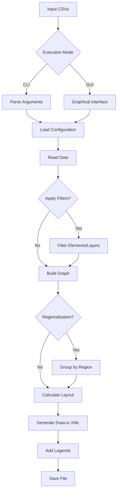

# 🌐 NETWORK TOPOLOGY GENERATOR FOR DRAW.IO

[](https://opensource.org/licenses/MIT)


### 🧩 Transform network data into professional diagrams with a single click

The **Network Topology Generator for Draw.io** is an advanced tool that converts CSV files into complete, organized `.drawio` diagrams. Ideal for ISPs, telecommunication operators, enterprise network administrators, and infrastructure professionals.

🔧 **Highlighted Features**:
* 4 layout algorithms: Circular, Organic, Geographic, and Hierarchical
* Graphical User Interface (GUI) and Command Line Interface (CLI)
* **New**: Modern CLI presentation with task checklist and ANSI colors
* Automatic regionalization (e.g., CORE → CORE_SOUTHEAST)
* Automatic legends and multiple pages/views
* Advanced customization via `config.json`
* Support for geographic maps and DWDM/PTT elements
* Advanced element and layer filtering
* Option to hide node names and connection layers
* Special handling for elements lacking geographic location
* Node overlap prevention in the geographic layout

---

## 🔍 Overview
A tool for the automated generation of network diagrams (.drawio) starting from:
- Connections between equipment (`connections.csv`)
- Equipment data (`elements.csv`)
- Geographic locations (`locations.csv`)


## ⚙️ Dependency Installation

# Windows
1. Open the Microsoft Store
2. Search for "Python 3.12+"
3. Click Install
4. Install Python dependencies (CMD/PowerShell):
```bash
python -m pip install networkx chardet numpy pillow psutil scipy
```

# Linux (Debian/Ubuntu)
1. Install Python 3 and pip (apt):
```bash
sudo apt update && sudo apt install python3 pip python3-tk -y
```
2. Install Python dependencies:
```bash
python3 -m pip install networkx chardet numpy pillow psutil scipy
```

## 🚀 How to Use

### Download files
- `network-topology-generator.py`
- `config/` folder (containing `config.json`, `elements.csv`, etc.)
- `RunGui.bat` (optional, windows script to run the GUI directly)

### Graphical Mode (GUI)
```bash
python network-topology-generator.py
```

### Terminal Mode (CLI)
```bash
python network-topology-generator.py [OPTIONS] connections.csv connections2.csv connectionsN.csv
```

### ⚡ CLI Options
| Option | Description | Default | Example |
|--------|-------------|---------|---------|
| `-y` | Include nodes without connections (orphans) | `False` | `-y` |
| `-t cog` | Layouts (c=circ, o=org, g=geo, h=hier) | `cogh` | `-t co` |
| `-r` | Enable regionalization | `False` | `-r` |
| `-g DIR` | Directory containing CSV files | `None` | `-g data/` |
| `-e PATH` | Path to elements file | `config/elements.csv` | `-e elements.csv` |
| `-s PATH` | Path to localities file | `config/locations.csv` | `-s locations.csv` |
| `-c PATH` | Path to configuration file | `config/config.json` | `-c config.json` |
| `-w PATH` | Custom directory for output | `.` | `-w output/` |
| `-o nc` | Options: n (no names), c (hide connections) | `""` | `-o n` |
| `-d` | Ignore customizations in CSV files | `False` | `-d` |
| `-f FILTER` | Filter elements/layers | `None` | `-f "in:RTIC;RTOC"` |
| `-l` | Generate log files | `False` | `-l` |
| `-v` | Verbose mode (logs on screen) | `False` | `-v` |

## 📂 Input Files

### 1. connections.csv (Mandatory)
```csv
endpoint-a;endpoint-b;connectiontext;strokeWidth;strokeColor;dashed;fontStyle;fontSize
RTIC-SPO99-99;RTOC-SPO98-99;Main Link;2;#036897;0;1;14
```

### 2. elements.csv (Optional)
```csv
element;layer;level;color;siteid;alias
RTIC-SPO99-99;INNER-CORE;1;#FF0000;SP01;Core-SP
```

### 3. locations.csv (Optional)
```csv
siteid;Location;GeographicRegion;Latitude;Longitude
SP01;SAOPAULO;Southeast;23.32.33.S;46.38.44.W
```

> **Resilient Headers**: The script supports both hyphenated (`endpoint-a`) and underscore (`endpoint_a`) headers, as well as `connection_text`.
> **Coordinate format**: Degrees.Minutes.Seconds.Direction (e.g., 23.32.33.S)

## ⚙️ Advanced Configuration (config.json)

### Main Sections
```json
{
  "LAYER_DEFAULT_BY_PREFIX": {
    "RTIC": {"camada": "INNER-CORE", "nivel": 1},
    "RTOC": {"camada": "OUTER-CORE", "nivel": 2}
  },
  "LAYER_COLORS": {
    "INNER-CORE": "#036897",
    "OUTER-CORE": "#0385BE"
  },
  "LAYER_STYLES": {
    "INNER-CORE": {
      "shape": "mxgraph.cisco19.rect",
      "prIcon": "router",
      "width": 50,
      "height": 50
    }
  },
  "PAGE_DEFINITIONS": [
    {"name": "GENERAL VIEW", "visible_layers": null}
  ],
  "GEOGRAPHIC_LAYOUT": {
    "canvas_width": 5000,
    "background_image": {
      "url": "brazil_map.png"
    }
  }
}
```

### Key Parameters
1. **LAYER_DEFAULT_BY_PREFIX**: Maps prefixes to layers/levels
2. **LAYER_COLORS**: Default colors per layer
3. **LAYER_STYLES**: Equipment appearance (shapes, icons, sizes)
4. **PAGE_DEFINITIONS**: Diagram views/pages
5. **Layouts**: Specific parameters for each algorithm:
   - `CIRCULAR_LAYOUT`: center_x, center_y, base_radius
   - `ORGANIC_LAYOUT`: k_base, iterations_per_node
   - `GEOGRAPHIC_LAYOUT`: canvas_width, background_image
   - `HIERARCHICAL_LAYOUT`: vertical_spacing

## 🛠️ Practical Examples

### 1. Complete generation with regionalization
```bash
python network-topology-generator.py -t cogh -r networks.csv
```

### 2. Filter specific elements
```bash
python network-topology-generator.py -f "in:RTIC;RTOC" -t c backbone.csv
```

### 3. Advanced options
```bash
python network-topology-generator.py -y -d -o nc -t gh -l main_network.csv
```

## ⚠️ Troubleshooting

| Problem | Solution |
|---------|----------|
| Overlapping nodes | Increase `radius_increment` (circular) or `min_distance` (geographic) |
| Red elements in center | Nodes lacking a siteid in `locations.csv` |
| Geographic layout not generated | Check `elements.csv` and `locations.csv` |
| Invalid JSON | Validate at [jsonlint.com](https://jsonlint.com) |
| Nodes outside diagram | Adjust `center_x/center_y` in config.json |
| Overlapping connections | Enable prevention in `CONNECTION_STYLE_BASE` |

## 📌 Important Tips

1. **Configuration Hierarchy**:
   - `config.json` > CLI Options > CSV Data
   - Use `-d` to ignore customizations natively set in CSVs

2. **Geographic Layout**:
   - Requires `elements.csv` and `locations.csv`
   - Nodes without siteid or coordinates are placed in a central spiral (`TO_REVIEW` layer)
   - A specific `geographic_review.log` is generated listing these elements
   - To prevent overlapping, increase `min_node_distance`

3. **Advanced Filtering**:
   ```bash
   # Only RTIC/RTOC elements:
   -f "in:RTIC;RTOC" 
   
   # Remove METRO/ACCESS layers:
   -f "rc:METRO;ACCESS"
   ```

4. **Performance**:
   - For large networks (>500 nodes), prefer Circular or Hierarchical layout
   - Use `-l` to generate detailed logs

## 📤 Output
Files in format:  
`FileName_TIMESTAMP_layout.drawio`  
Ex: `sp_network_20250615143045_geographic.drawio`

> **View the generated files**: [app.diagrams.net](https://app.diagrams.net/) or Draw.io Desktop

## 🔄 Processing Flow



🔗 **Official Repository**:  
https://github.com/flashbsb/network-topology-generator

📜 **License**:  
[MIT License](https://github.com/flashbsb/network-topology-generator/blob/main/LICENSE)
